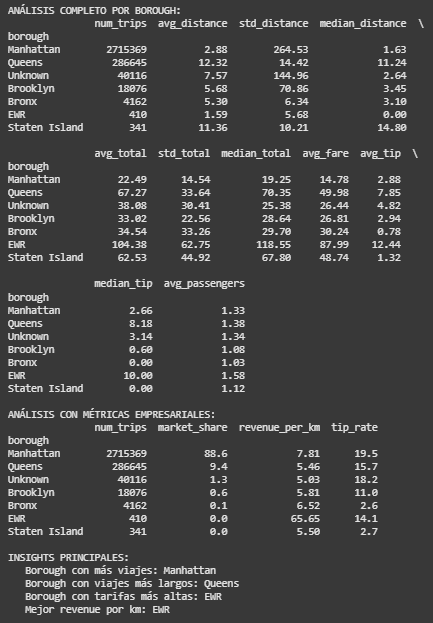
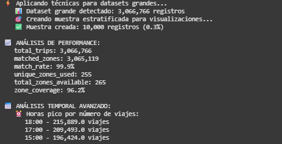
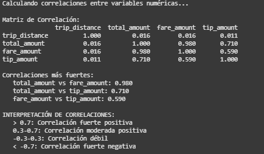

# UT1 - Actividad 3 - Dataset Netflix

## Contexto

Exploración del dataset de taxis, el mismo viene de diversas fuentes con distintas informaciones, una trae las zonas y otra el calendario con fechas importantes.
La idea normalizar los datos y relizar las combinaciones que nos permitan facilitar las rutas en momentos complejos por fechas de eventos.

## Objetivos

- Aprender a integrar datos de múltiples fuentes
- Dominar los diferentes tipos de joins con pandas
- Realizar análisis agregados con groupby
- Crear reportes consolidados de datos integrados

## Actividades (con tiempos estimados)

- 1. Investigar dataset y cargar los datos de las distintas fuentes - 10 min
- 2. Limpieza y normalización de datos - 20 min
- 3. Joins de los datos - 30 min
- 4. Análisis por Borough - 20 min
- 4. Análisis por Borough y Día Especial - 15 min
- 5. Aplicación de técnicas para datasets grandes - 30 min
- 6. Documentación y reflexiones- 30 min

## Desarrollo

- 1. Carga de datos multi-fuente: Se importaron 3M de registros de viajes desde Parquet, la tabla de lookup de zonas desde CSV y el calendario de eventos desde JSON.

- 2. Limpieza y normalización: Estandarización de nombres de columnas, optimización de tipos de datos (reducción de memoria en 8.1%), manejo de valores nulos y creación de columna de fecha para joins.

- 3. Joins de datos: LEFT JOIN entre trips y zones para enriquecimiento geográfico (99.9% de match rate), seguido de LEFT JOIN con calendario para identificar días especiales.

- 4. Análisis por Borough: Agregaciones con groupby para calcular métricas clave: número de viajes, distancia promedio, tarifa promedio, revenue por km y tasa de propina por borough.

- 5. Aplicación de técnicas para datasets grandes: Muestreo estratificado para big data, análisis comparativo días especiales vs normales, y análisis temporal por hora para identificar patrones de demanda.

- 6. Documentación: Registro dentro de el portafolio y responder las preguntas en base a la infromación analizadad.

## Evidencias

- Ingresar al análisis [Abrir Practicos](../../Practicos/practico4.ipynb)

## Reflexión

La integración de múltiples fuentes (Parquet, CSV, JSON) mediante joins fue el núcleo del proyecto. Dominar las agregaciones con groupby transformó los datos en métricas clave, mientras que el gran volumen exigió optimizar el rendimiento con técnicas y formatos eficientes.
