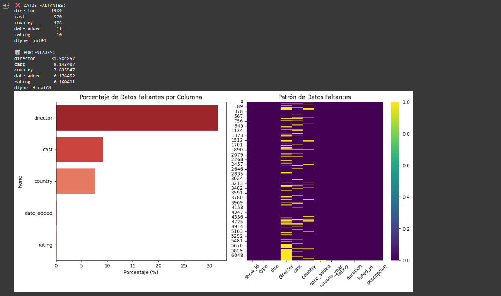
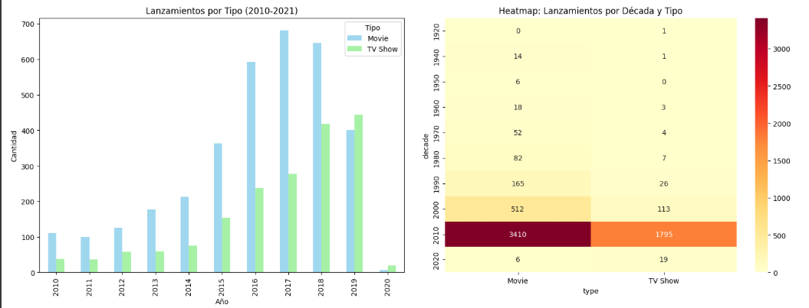
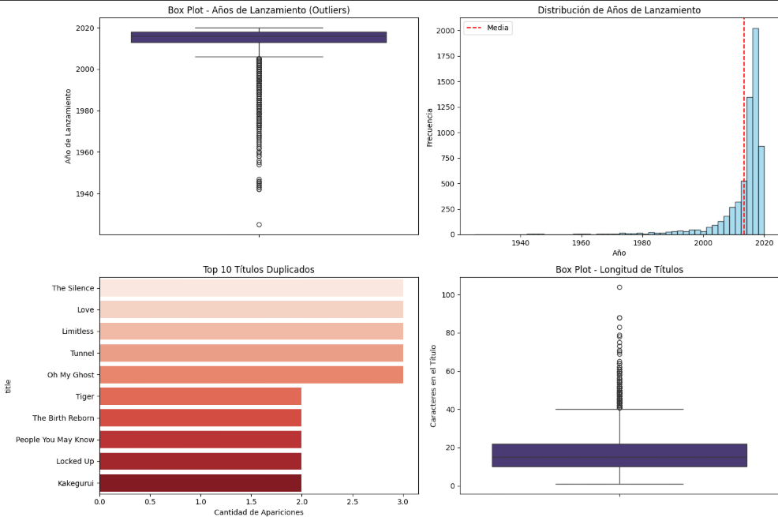
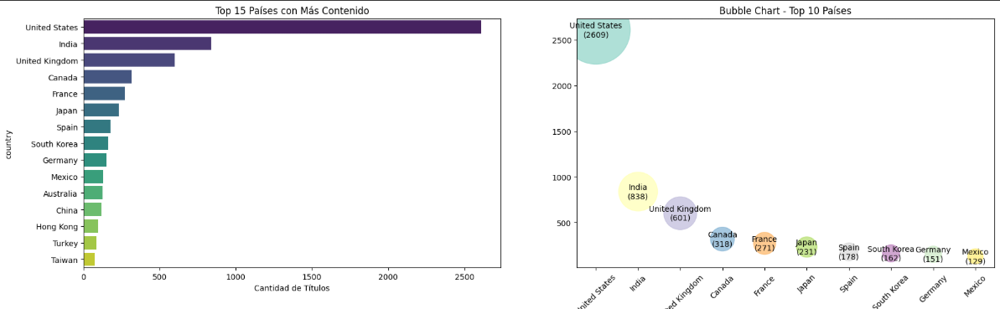

# UT1 - Actividad 3 - Dataset Netflix

## Contexto

Exploración del dataset dde netflix

## Objetivos

- Explorar el dataset
- Aplicar técnicas de limpieza de datos y de EDA (análisis de datos exploratorio)
- Plantear sugerencias a Netflix respecto el modelo de negocio

## Actividades (con tiempos estimados)

- 1. Investigar dataset - 20 min
- 2. Limpieza de datos - 30 min
- 3. Análisis de los datos - 30 min
- 4. Visualizaciones - 40 min
- 5. Documentación y reflexiones- 30 min

## Desarrollo

- 1. Investigación del dataset:
     El dataset es de Netflix, contiene información detallada sobre el catálogo de contenido de la plataforma.

- 2.  Limpieza de datos:
      La limpieza mostró una gran parcela de datos faltantes, ante eso se realizó un análisis de los datos faltantes. Posteriormente se descartaron incongruencias o datos con anomalías.

- 3.  Análisis de los datos:
      Primeramente se realizaron diversos análisis del contenido:
      - Por categrías
      - Temporal
      - Geográfico
      - Por género

- 4. Visualizaciones:
     Se realizaron las visualizaciones con el fin de contestar las siguientes preguntas:

     ¿Qué tipo de visualización es más efectiva para mostrar distribuciones temporales? 💡 PISTA: Compara line plot vs area plot vs bar plot

     ¿Por qué usamos diferentes tipos de gráficos para diferentes datos? 💡 PISTA: 🔗 Guía de tipos de gráficos

     ¿Qué insights de negocio obtuviste que Netflix podría usar? 💡 PISTA: Piensa en estrategias de contenido, mercados objetivo, tipos de producción

     ¿Cuál fue la visualización más reveladora y por qué? 💡 PISTA: ¿Qué patrón no esperabas ver?

     ¿Cómo mejorarías este análisis con más datos? 💡 PISTA: Datos de audiencia, ratings de IMDb, presupuestos, etc.

     Dentro de las visualizaciones vemos:

     Datos faltantes: Muestra columnas con valores nulos, clave para la limpieza de datos.

     Análisis temporal: Ilustra la evolución del catálogo de Netflix a lo largo del tiempo.

     Análisis geográfico: Presenta la distribución del contenido por países de origen.

- 5. Documentación: Registro dentro de el portafolio y responder las preguntas en base a la infromación analizadad.

## Evidencias

- Ingresar al análisis [Open Practicos](../../Practicos/practico3.ipynb)

## Reflexión

Esta actividad sirvió como un primer acercamiento a la materia, familiarizando a los estudiantes con las tecnologías a implementar y al contexto en cuál se somete un profesional al realizar análisis de datos.
