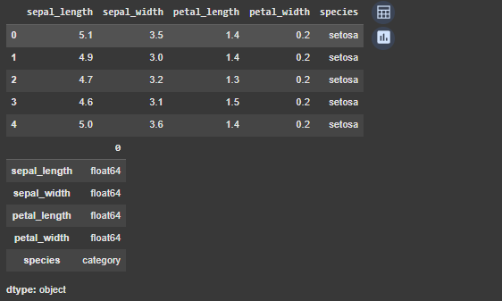
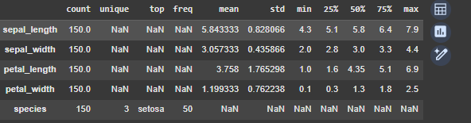
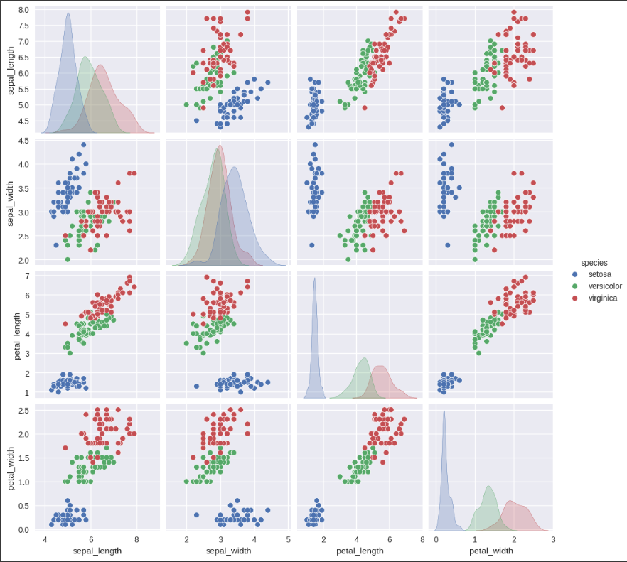

# UT1 - Actividad 3 - Dataset Netflix

## Contexto

Exploración del dataset dde netflix

## Objetivos

- Explorar el dataset
- Aplicar técnicas de limpieza de datos y de EDA (análisis de datos exploratorio)
- Plantear sugerencias a Netflix respecto el modelo de negocio

## Actividades (con tiempos estimados)

- 1. Investigar dataset - 20 min
- 2. Limpieza de datos - 30 min
- 3. Análisis de los datos - 30 min
- 4. Visualizaciones - 40 min
- 5. Documentación y reflexiones- 30 min

## Desarrollo

- 1. Investigación del dataset:
     El dataset es de Netflix, contiene información detallada sobre el catálogo de contenido de la plataforma.

- 2.  Limpieza de datos:
      La limpieza mostró una gran parcela de datos faltantes, ante eso se realizó un análisis de los datos faltantes. Posteriormente se descartaron incongruencias o datos con anomalías.

- 3.  Análisis de los datos:
      Primeramente se realizaron diversos análisis del contenido:
      - Por categrías
      - Temporal
      - Geográfico
      - Por género

- 4. Visualizaciones: Por último la información se desplegó el dashboard, mostrando en simultáneo diversas métricas para responder a las preguntas planteadas

- 5. Documentación: Registro dentro de el portafolio y responder las preguntas en base a la infromación analizadad.

## Evidencias

- Ingresar al análisis [Open Practicos](../../Practicos/Practico_3.ipynb)

## Reflexión

Esta actividad sirvió como un primer acercamiento a la materia, familiarizando a los estudiantes con las tecnologías a implementar y al contexto en cuál se somete un profesional al realizar análisis de datos.
