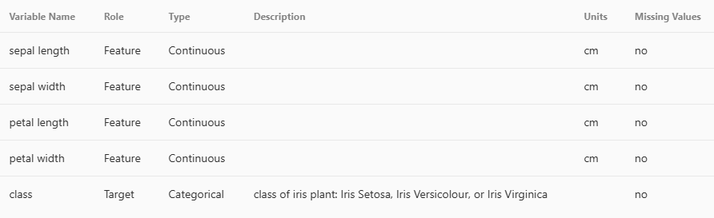

# Actividad 1

## Contexto

Exploración del dataset Iris

## Objetivos

- Objetivo específico y medible

## Actividades (con tiempos estimados)

- 1. Configurar entorno - 5 a 10 min
- 2. Investigar dataset - 10 min
- 3. Preguntas de negocio - 5 min

## Desarrollo

- 1. Configuración de entorno:
     Seeleccioné visual studio code como el entorno para realizar la taea, mediante un archivo python Júpiter -entorno intereactivo- de extensión ipynb

- 2. Investigación del dataset:
     El dataset es de una planta de iris, esta es una flor colorida la cual se eligió porque tiene caracterísicas medibles como la longitud y el ancho del sépalo y el pétalo, de ahí salen sus 3 subespecies: iris versicolor, setosa y virginica.
     El mismo contiene 3 clases con 50 instancias cada una.

  

- 3.  Preguntas de negocio:
      Escribe 3–5 preguntas propias y ordénalas por prioridad.

      ¿Qué especie de iris tiene la mayor variabilidad en la longitud del sépalo?

      ¿Existe una correlación positiva entre la longitud del sépalo y la longitud del pétalo?

      ¿Existen diferencias notables en la longitud del pétalo entre las diferentes especies?

Resumen de lo realizado, decisiones y resultados intermedios.

## Evidencias

- Capturas, enlaces a notebooks/repos, resultados, gráficos

## Reflexión

- Qué aprendiste, qué mejorarías, próximos pasos

## Referencias

Pandas: DataFrame.describe
Pandas: read_csv
Seaborn: load_dataset
Seaborn: pairplot
Seaborn: heatmap
Matplotlib: savefig

---

## Guía de formato y ejemplos (MkDocs Material)

Usá estos ejemplos para enriquecer tus entradas. Todos funcionan con la configuración del template.

### Admoniciones

!!! note "Nota"
Este es un bloque informativo.

!!! tip "Sugerencia"
Considerá alternativas y justifica decisiones.

!!! warning "Atención"
Riesgos, limitaciones o supuestos relevantes.

### Detalles colapsables

???+ info "Ver desarrollo paso a paso" - Paso 1: preparar datos - Paso 2: entrenar modelo - Paso 3: evaluar métricas

### Código con resaltado y líneas numeradas

```python hl_lines="2 6" linenums="1"
def train(
    data_path: str,
    epochs: int = 10,
    learning_rate: float = 1e-3,
) -> None:
    print("Entrenando...")
    # TODO: implementar
```

### Listas de tareas (checklist)

- [ ] Preparar datos
- [x] Explorar dataset
- [ ] Entrenar baseline

### Tabla de actividades con tiempos

| Actividad              | Tiempo | Resultado esperado             |
| ---------------------- | :----: | ------------------------------ |
| Revisión bibliográfica |  45m   | Lista de fuentes priorizadas   |
| Implementación         |  90m   | Script ejecutable/documentado  |
| Evaluación             |  60m   | Métricas y análisis de errores |

### Imágenes con glightbox y atributos

Imagen directa (abre en lightbox):

{ width="420" }

Click para ampliar (lightbox):

[{ width="280" }](../assets/placeholder.png)

### Enlaces internos y relativos

Consultá también: [Acerca de mí](../acerca.md) y [Recursos](../recursos.md).

### Notas al pie y citas

Texto con una afirmación que requiere aclaración[^nota].

[^nota]: Esta es una nota al pie con detalles adicionales y referencias.

### Emojis y énfasis

Resultados destacados :rocket: :sparkles: y conceptos `clave`.
