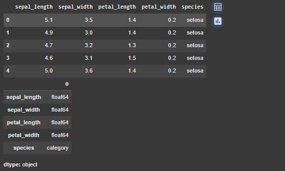
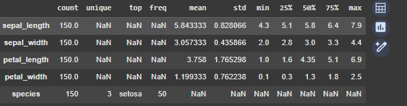
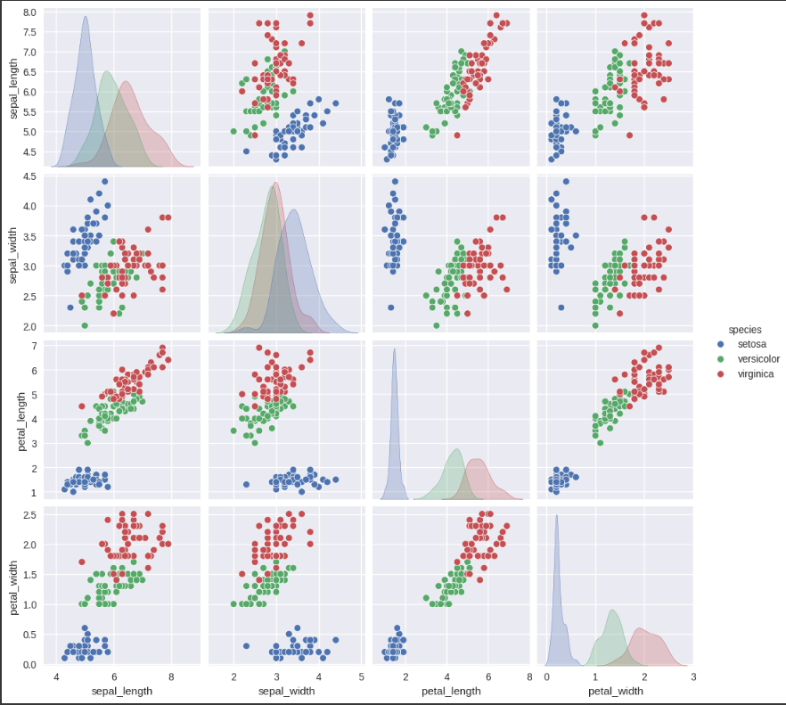

# UT1 - Actividad 1 - Dataset Iris

## Contexto

Exploración del dataset Iris, implementando las librerías seaborn, scikit-learn, kaggle API

## Objetivos

- Explorar el dataset
- Realizar planteos que nos permitan aplicar las herramientas brindadas por las librerías
- Realizar un diccionaíp de datos
-

## Actividades (con tiempos estimados)

- 1. Configurar entorno - 10 min
- 2. Investigar dataset - 20 min
- 3. Análisis de los datos - 40 min
- 4. Visualizaciones - 40 min
- 5. Documentar - 30 min

## Desarrollo

- 1. Configuración de entorno:
     Seeleccioné visual studio code como el entorno para realizar la taea, mediante un archivo python Júpiter -entorno intereactivo- de extensión ipynb.
     Una vez realizamos la estracción del csv con los datos y los preparamos para trabajar.

- 2. Investigación del dataset:
     El dataset es de una planta de iris, esta es una flor colorida la cual se eligió porque tiene caracterísicas medibles como la longitud y el ancho del sépalo y el pétalo, de ahí salen sus 3 subespecies: iris versicolor, setosa y virginica.
     El mismo contiene 3 clases con 50 instancias cada una.

- 3.  Preguntas de negocio:
      Escribe 3–5 preguntas propias y ordénalas por prioridad.

      ¿Qué especie de iris tiene la mayor variabilidad en la longitud del sépalo?

      ¿Existe una correlación positiva entre la longitud del sépalo y la longitud del pétalo?

      ¿Existen diferencias notables en la longitud del pétalo entre las diferentes especies?

Resumen de lo realizado, decisiones y resultados intermedios.

## Evidencias

- Ingresar al análisis [Open Practicos](../Practicos/practico1.ipynb)

## Reflexión

Esta actividad sirvió como un primer acercamiento a la materia, familiarizando a los estudiantes con las tecnologías a implementar y al contexto en cuál se somete un profesional al realizar análisis de datos.
